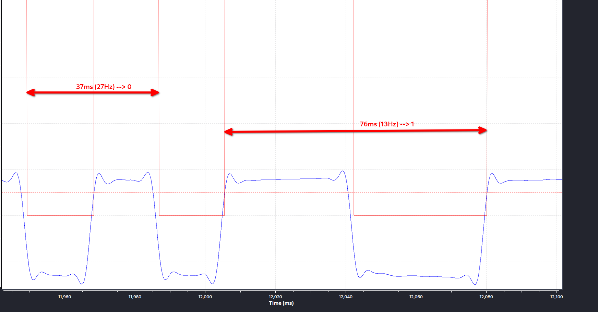

# Mitsubishi Keyfob Hacking

## Introduction
While browsing youtube for CCC content the video of Samy Kumkar popped up 
[Link](https://www.youtube.com/watch?v=iSSRaIU9_Vc&t=1s&ab_channel=SamyKamkar).
He describes how he is hacking Garage Doors with a Matel device. This got my interest started and 
after falling down the rabbit hole I had ordered an hackRF one and some other parts.

## My "old" car and his keyfob

As I did not have a garage door I was looking at my keyfob of my Mitsubshi Lancer built in the year 2001. I still own 
this car to date. The key fob identified as an _G8D-525M-A Automotive Security Transmitter_. The FCC Page gives a first 
insight into this key fob [Link](https://fccid.io/OUCG8D-525M-A). After setting up my hackRF I captured the first 
signals on ~433Mhz. Besides, that I did not have much of an idea how to go forward from here.


## Mobile Communication and GNU Radio
After watching most of Micheal Ossman's SDR Video Series [Link](https://greatscottgadgets.com/sdr/) I knew I had
to dive into GNU Radio Companion. At the same I started a module at my university called _Mobile Communications_
which influenced and/or fueled my interest in this field even more.

## Analysing the Signal

Sofar I knew that the key fob was transmitting at 433Mhz. After reading along I learned that the signal form
I recorded using _GQRX_ and hackRF one, points towards a FSK modulated signal. Identified by symmetrical
signal shape with two peaks.


Derived from that information is started googling how one would extract information from a signal using GRC. 
I found this tutorial by _eapbg_ [Link](https://www.youtube.com/watch?v=enLbgn1qBS4&t=2545s&ab_channel=eapbg).
With his help I assume I was able to decode the signal from the key fob.

The GRC Flow Chart:


The analog and digitised signal:


### Demodulating FSK
While looking at the above plot I recoginsed the FSK modulation. With the help a small python script in the 
_Embedded Python Block_ I determined that long durations must be a 1 and short durations are a 0. When I plotted
this it looked like this (**index**: the index of the captured signal object, **value**: the duration between this and
the last signal):


Deriving from the plot above, the "lock" signal is sent twice. Looking closer at one "lock" signal, I figured out that
the preamble has to be four 1 in a row. The end of the signal is identified with a long duration.
```commandline
    for index, d in enumerate(durations):
        if d > 1000 or signal_started:
            signal_started = True
            if 1000 < d < 1500:
                signal1.append(1)
            if d < 1000:
                signal1.append(0)
            if d > 1500:
                signal_end = index + 1  # save where signal has ended in the data
                signal_started = False
                break
```


Detailed look at one signal part:
<ol>
<li>Signal preamble seems to be four 1's</li>
<li>Counting the zeros and ones, the signal is 60 Bit long</li>
<li>The signal ends with a high duration</li>
</ol>


### More Signal Insight

Looking at the cycle duration of the signal:
```
For a 0 = 37ms cycle time equals 27Hz
For a 1 = 76ms cycle time equals 13Hz
```




### From Bitstreams to Keys

Pressing the keyfob _LOCK_ button multiple times just revealed different bitstreams of length 60. For example:

`111110000010000000111000001110011001011000100000001110110100`

After converting them to DEC I saw that when I get the DEC difference between them
the difference repeats itself after eight bitstreams. 
```commandline
list_of_bistreams = [
"111110000010000000111000001110011001011000100000001110110100",
"111110000010000001001000001110011001011000100000001101011011",
"111110000010000001011000001110011001011000100000001111111001",
"111110000010000001101000001110011001011000100000001101100000",
"111110000010000001111000001110011001011000100000001111000010",
"111110000010000010001000001110011001011000100000001111000001",
"111110000010000010011000001110011001011000100000001101100011",
"111110000010000010101000001110011001011000100000001111111010",
"111110000010000010111000001110011001011000100000001101011000",
"111110000010000011001000001110011001011000100000001110110111",
"111110000010000011011000001110011001011000100000001100010101",
"111110000010000011101000001110011001011000100000001110001100",
"111110000010000011111000001110011001011000100000001100101110",
]
```
| Signal in HEX   | Diff to previous signal HEX | Diff No. |
|-----------------|-----------------------------|----------|
| F820383996203B4 | n/a                         | n/a      |
| F8204839962035B | FFFFFFE180                  | 1        |
| F820583996203F9 | 10000000900                 | 2        |
| F82068399620360 | 10000000880                 | 3        |
| F820783996203C2 | 10000000880                 | 4        |
| F820883996203C1 | FFFFFFE200                  | 5        |
| F82098399620363 | 10000000880                 | 6        |
| F820A83996203FA | 10000000880                 | 7        |
| F820B8399620358 | 10000000900                 | 8        |
| F820C83996203B7 | 10000000880                 | **1**    |
| F820D8399620315 | FFFFFFE180                  | **2**    |
| F820E839962038C | 10000000900                 | **3**    |
| F820F839962032E | 10000000880                 | **4**    |


After XORing each signal with the one before
it results in what I call the keys for this key fob:
```commandline
keys = [
    "000000000000000001110000000000000000000000000000000011101111",
    "000000000000000000010000000000000000000000000000000010100010",
    "000000000000000000110000000000000000000000000000000010011001",
    "000000000000000000010000000000000000000000000000000010100010",
    "000000000000000011110000000000000000000000000000000000000011",
    "000000000000000000010000000000000000000000000000000010100010",
    "000000000000000000110000000000000000000000000000000010011001",
    "000000000000000000010000000000000000000000000000000010100010",
        ]
keys_hex = [
    "700000000EF",
    "100000000A2",
    "30000000099",
    "100000000A2",
    "F0000000003",
    "100000000A2",
    "30000000099",
    "100000000A2",
        ]
```

### Ideation on an Attack Vector
Now with this list of keys available, I assume that it would be possible to capture the signal
from the keyfob and than create 8 signals by XORing each key with this signal:
```commandline
(PSEUDO CODE)
for key in keys:
    hackRF.transmit(xor(signal,key))
```

## Attacking [Todo]

### Learning more about the signal
Measuring the signal again in SDR-Console shows that the two peaks are about 80kHz appart, with a center frequenzy of 433.909Mhz.


Deriving from [this](https://www.infineon.com/dgdl/TDA7110F_AN_Keyfob_Transmitter_Reference_v1.0.pdf?fileId=db3a30433a047ba0013a6e9580805ff1) 
document found online about FSK, a frequency shift of 40kHz seams reasonable. Also this document states a **Datarate** of `2400 bits/sec` for a manchester
encoded stream.


